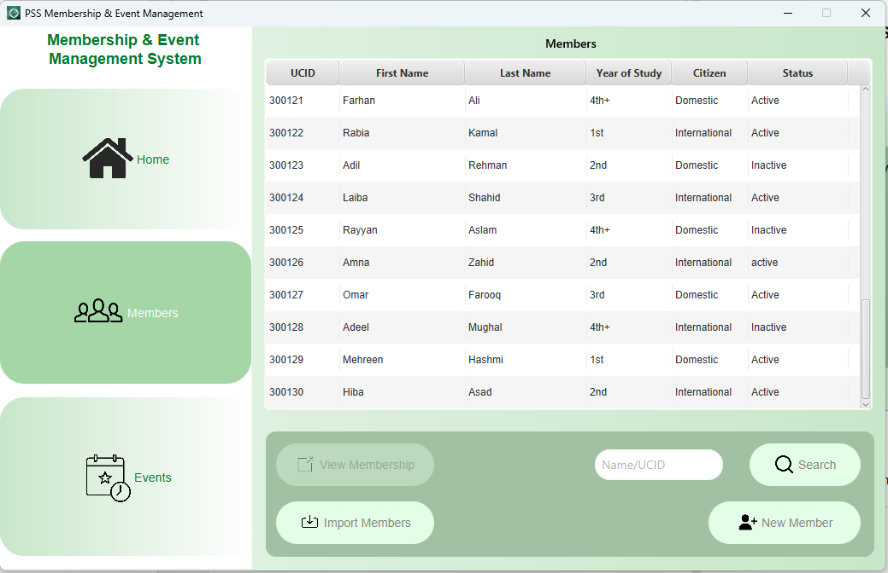

# 🎉 PSS Membership Management System

After witnessing delays and inefficiences in our current membership and event management process, I developed an application to streamline the management of memberships and event registrations
for the Pakistani Students' Society at the University of Calgary.

---

## 🚀 Features
- **Membership Management**: Add, edit, and track members with active/inactive status and 
visualize memberships for informed decision-making.
- **Event Registrations**: View and analyze event ticket purchases by members and non-members. 
This greatly reduces processing time at the day of the event and help us avoid long queues.

---

## 🖼️ Screenshots
**Disclaimer: For privacy reasons, the data in these screenshots is AI-generated and does not represent actual members of the club*
### Homepage
- Contains total, active, and inactive members
- Displays visual statistics for better decision making
- Displays most recent members

### Members page
- Displays a list of members and their details
- Option to select a row and view that member's membership data
- Option to add member both manually, and by importing *.csv* file
- Option to search a member with any part of UCID or their name

Member search by name in action:

#### Membership details window
- Option to update various attributes of a member
- Option to permanently delete member data
- ***FUTURE: Option to view member's attendance in past events***

Adding member window:

### Events page
- Ability to load *.csv* event file containing registrations
- Option to search for a registration by UCID or name
- Option to add a non-member as member by selecting a row
- Toggle member/non-member tickets only
- Highlight registrations that are errorneous

People who are either non-members and have purchased members ticket 
or are inactive members and have purchased member tickets are flagged. 
They can either be contacted prior to the event or at the day of:

Member tickets toggled in action:

---

## 💻 Technologies Used

- JavaFX: Frontend for the application.
- SQLite: Database for storing member and event details.
- OpenCSV: Parsing CSV files for data management.

---

## 📧 Contact
For questions or suggestions, reach out at:

- Email: usharabkhan@gmail.com
- LinkedIn: [Usharab Khan](https://www.linkedin.com/in/usharabkhan/)